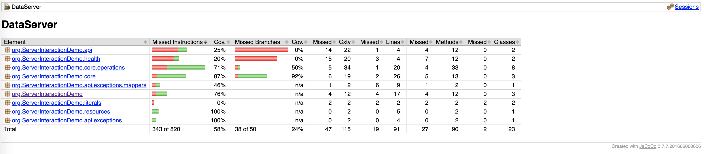

# DataServer

How to start the DataServer application
---

1. Run `mvn clean install` to build your application
1. Build your packages by running `mvn package`
1. Start application with `java -jar target/DataServer-1.0-SNAPSHOT.jar server config.yml`
1. To check that your application is running enter url `http://localhost:9000/static`

## Health Check

To see your applications health enter url `http://localhost:9001/healthcheck`

### Test Coverage
Current coverage is `58%`. 

Browse `target/jacoco.exe` for more details.
### To Do
- [x] Create a Static Endpoint
- [x] Create a [fat jar](https://www.baeldung.com/executable-jar-with-maven)
- [x] Integrate Lombok
- [x] Integrate Endpoint which will perform Multiplication
- [x] Integrate Swagger
- [x] Test sf4j application logging
- [x] Implement custom exception Handler
- [x] Configure jUnit @ 5
- [x] Setup CI
- [x] [Dockerize App](https://xebia.com/blog/how-to-dockerize-your-dropwizard-application/)
- [x] Integrate Jacoco Coverage

### Nice To Have
- [ ] Enable PMD
- [ ] Enable Bugzilla  